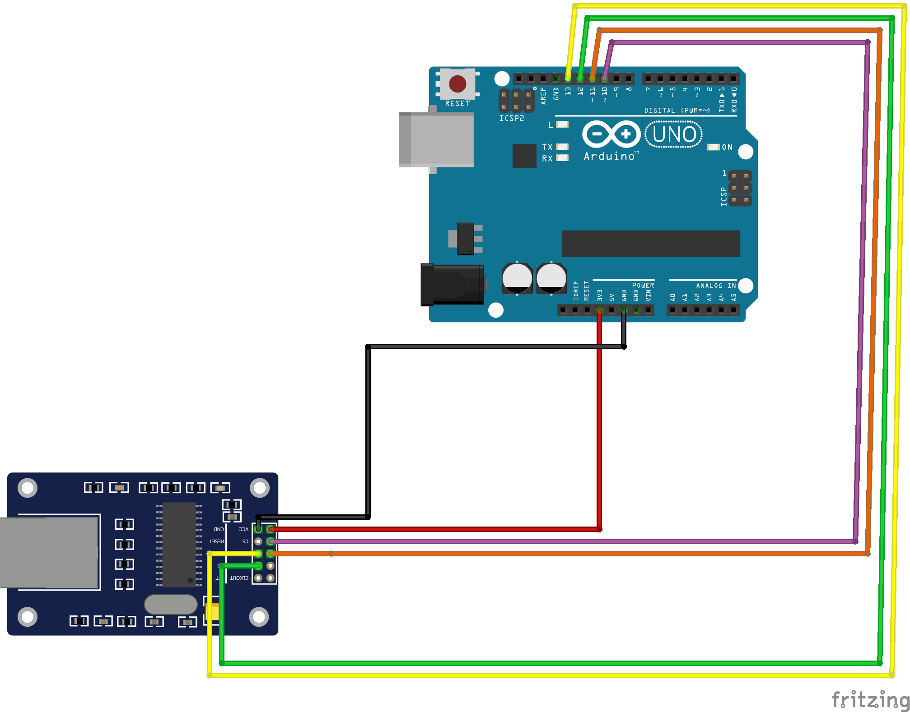

# Artem 
### The no-BS atari 8-bit plug and go ethernet modem.

## Hardware
We are using an arduino UNO and the ENC28J60 ethernet board as the initial test base.  Once this is solid, the idea is to start working on a circuit board to decrease cost and size.

### The connections
**NOTE:** *For the time being, this is text - hopefully, I'll have time to create a diagram to show the connectivity*

#### Arduino - ENC28J60
Connect the Ethernet module to the Arduino using the SPI interface.

* Arduino Uno 3.3V to ENC28J60 VCC
* Arduino Uno GND to ENC28J60 GND
* Arduino Uno Pin 13 (SCK) to ENC28J60 SCK
* Arduino Uno Pin 12 (MISO) to ENC28J60 SO
* Arduino Uno Pin 11 (MOSI) to ENC28J60 SI
* Arduino Uno Pin 10 (SS) to ENC28J60 CS

#### Atari SIO port to Arduino Uno
Here is the wiring scheme from Atari SIO to Arduino Uno:

* Atari SIO Pin 1 (Data Out) to TXB0104 A1
* Atari SIO Pin 3 (Data In) to TXB0104 B1
* Atari SIO Pin 4 (Clock In) to TXB0104 A2
* Atari SIO Pin 10 (Clock Out) to TXB0104 B2
* Atari SIO Pin 5 (+5V/Ready) to TXB0104 VCCA, TXB0104 VCCB
* Atari SIO Pin 6 (Ground) to Arduino Uno GND
* TXB0104 A3 to Arduino Uno digital Pin 2
* TXB0104 B3 to Arduino Uno digital Pin 3
* TXB0104 A4 to Arduino Uno digital Pin 4
* TXB0104 B4 to Arduino Uno digital Pin 5

#### Decoupling Capacitors
* TXB0104 VCCA to Ground ---- 0.1uF Ceramic Capacitor
* TXB0104 VCCB to Ground ---- 0.1uF Ceramic Capacitor

**NOTE:** *The connections between the Atari SIO port and the Arduino Uno now specify the use of the TXB0104 bidirectional level shifter. The TXB0104 A1, B1, A2, and B2 pins are connected to the corresponding Atari SIO pins for data and clock signals. The TXB0104 VCCA and VCCB pins are connected to the Atari SIO +5V/Ready pin for power supply.*

*The TXB0104 A3, B3, A4, and B4 pins are connected to the corresponding digital pins on the Arduino Uno for data and clock signals. The decoupling capacitors (0.1uF ceramic capacitors) are added between the TXB0104 VCCA and ground, and between the TXB0104 VCCB and ground to improve stability.*

## How the code works

**handleModemCommand():** This function checks if data is available on the serial line, processes incoming commands, and handles them accordingly. It supports several commands like 'ATD' (dial), 'ATH' (hangup), 'ATS' (S register command), and 'ATZ' (reset).

**handleDialCommand():** This function dials to a server (either IP or domain name), resolving the domain name if necessary. If the connection is successful, it sends "CONNECT" over the serial line.

**handleHangUpCommand():** This function hangs up the current connection if the modem client is connected, and then sends "OK" over the serial line.

**handleSRegisterCommand():** This function handles setting/getting S register values.

**handleResetCommand():** This function resets the modem by disconnecting any current connection and resetting S registers to their default values.

**openConnection():** This function opens a connection to a host and port using either the modem client or the telnet client based on the provided protocol and connection ID.

**closeConnection():** This function closes a connection using either the modem client or the telnet client based on the provided connection ID.

**readDataFromConnection():** This function reads data from a connection using either the modem client or the telnet client based on the provided connection ID.

**writeDataToConnection():** This function writes data to a connection using either the modem client or the telnet client based on the provided connection ID.

**getDeviceStatus():** This function returns the status of the device by checking if it has an IP address assigned.

**getConnectionStatus():** This function returns the status of a connection based on the provided connection ID.

**readData():** This function reads data from the SoftwareSerial instance.

**relayModemData():** Placeholder function to relay data from the modem to the Atari.

**relayTelnetData():** Placeholder function to relay data from the telnet client to the Atari.

**handleTelnetProtocol():** Placeholder function to handle the telnet protocol.

**loadModemConfigFromEEPROM():** This function loads the modem configuration from the EEPROM.

**saveModemConfigToEEPROM():** This function saves the modem configuration to the EEPROM.

**setModemInitString():** This function sets the modem initialization string and saves it to EEPROM.

**setTelnetListenPort():** This function sets the telnet listen port and saves it to EEPROM.

**setBusyBanner():** This function sets the busy banner and saves it to EEPROM.

**setConnectBanner():** This function sets the connect banner and saves it to EEPROM.

**setSRegister():** This function sets an S register value and saves it to EEPROM.
